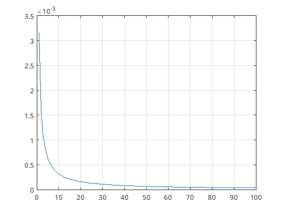

# Relazione 1

La prima esercitazione aveva come scopo quello di prendere confidenza con la rappresentazione dei numeri finiti in MATLAB e degli errori che derivano da approssimazioni ed operazioni utilizzando tale insieme di numeri.

## Es. 1
Il primo esercizio chiedeva di calcolare i parametri dell'insieme di numeri finiti usato da MATLAB.

**L** si ottiene banalmente calcolando il logaritmo in base 2 di *realmin*, mentre la formula per ottenere **U** è più complessa dal momento che *realmax* si ottiene da *(2-ε)⋅2^U* . I risultati sono quindi **L = -1022** e **U = 1023**, come previsto.

Il valore di **t** si ottiene da *ε = 2^(1-t)*, ed il risultato è **53**, come previsto dallo standard IEEE double precision.

Calcolando **UFL** ed **OFL** usando i valori appena trovati di **L** ed **U** i risultati sono corretti, avendo **UFL =  2.2251e-308** ed **OFL = 1.7977e+308**.

## Es. 2
Nel secondo esercizio veniva chiesto di calcolare *eps* usando una delle sue definizioni, cioè *fl(1 + ε) > 1*, formula che diventerà la condizione di terminazione del ciclo usato per calcolare ε.

Partendo da *ε = 1* e dimezzandolo ad ogni iterazione, il risultato finale è **2.2204e-16**, che corrisponde proprio al valore di *ε* fornito da MATLAB.

In questo caso non ci sono errori di troncamento in quanto il procedimento originario non è infinito, e quindi non viene troncato, ma viene applicata esattamente la definizione di *ε*.

## Es. 3
Nel terzo esercizio si chiedeva di calcolare il valore di *π* utilizzando l'apposita **formula di Leibniz**.

Il grafico seguente è stato ottenuto calcolando più volte la formula di Leibniz per *π* per diversi valori di *n*. Sull'asse x sono rappresentati i diversi valori di *n*, mentre sull'asse y è indicato l'errore relativo.

Come si può notare, la successione converge molto lentamente, e per *n = 10000* solamente le prime 3 cifre decimali sono certe essere corrette.

L'errore preponderante in questo caso è l'**errore di troncamento**, dovuto al fatto che il procedimento infinito per cui la formula di Leibniz converge viene troncato all'n-esimo termine, come ci si aspettava.

## Es. 4
Nel quarto esercizio veniva chiesto di calcolare un'approssimazione di *e* attraverso il limite per x che tende ad infinito della successione *(1+1/n)^n*, per valori di n arbitrariamente grandi.

Il grafico seguente mostra l'errore relativo del valore approssimato in funzione di n.

Dal grafico si può notare che l'errore minimo si ottiene per *n = 10^8*. Per valori di *n* più piccoli il risultato approssimato si avvicina sempre più al risultato effettivo, mentre per valori più grandi, il risultato tende a divergere dal valore esatto di *e* a causa di **errori di arrotondamento**.

La fonte di errore principale è la somma *1 + 1/n*, che genera un errore grande tanto quanto *n*. Tale errore viene poi amplificato dall'elevamento a potenza, che porta ad un risultato che si allontana sempre di più dal risultato esatto della successione per valori di *n* maggiori di *10^8*.

## Es. 5

Nell'ultimo esercizio la richiesta era quella di calcolare l'approssimazione della derivata prima di una funzione usando la formula del rapporto incrementale per diversi valori dell'incremento *h*. Nell'esercizio la funzione da derivare doveva essere *e^x*, nel caso di *x = 1*.

Il grafico seguente mostra come varia l'errore relativo in funzione di *h*, per valori che vanno da *10^-16 a 10^-1*.

L'errore minimo è *1.8766e-08*, si ottiene in corrispondenza di *h = 10^-8*, ed è di diversi ordini di grandezza più grande di *ε*, prevalentemente a causa della propagazione dell'errore nelle operazioni. Per valori più piccoli, gli errori dovuti alle approssimazioni delle operazioni in aritmetica finita pesano molto sul risultato, mentre per valori maggiori l'approssimazione risulta poco precisa a causa di valori troppo "grandi" di *h*.