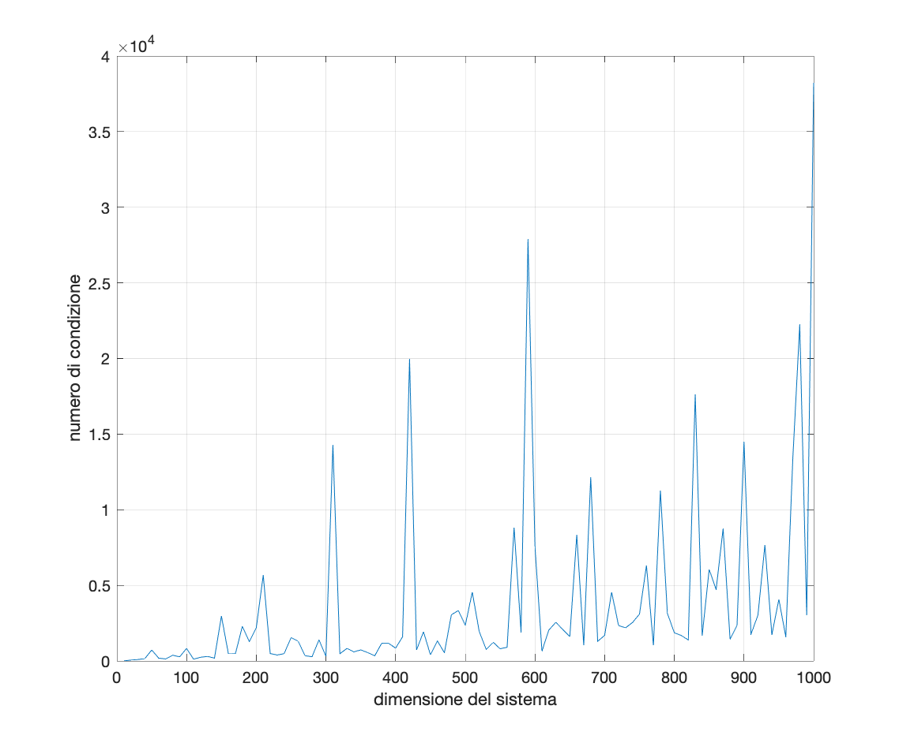
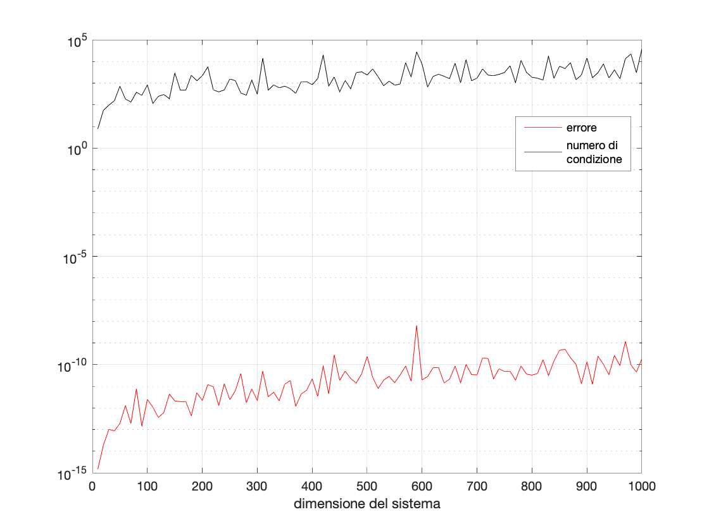
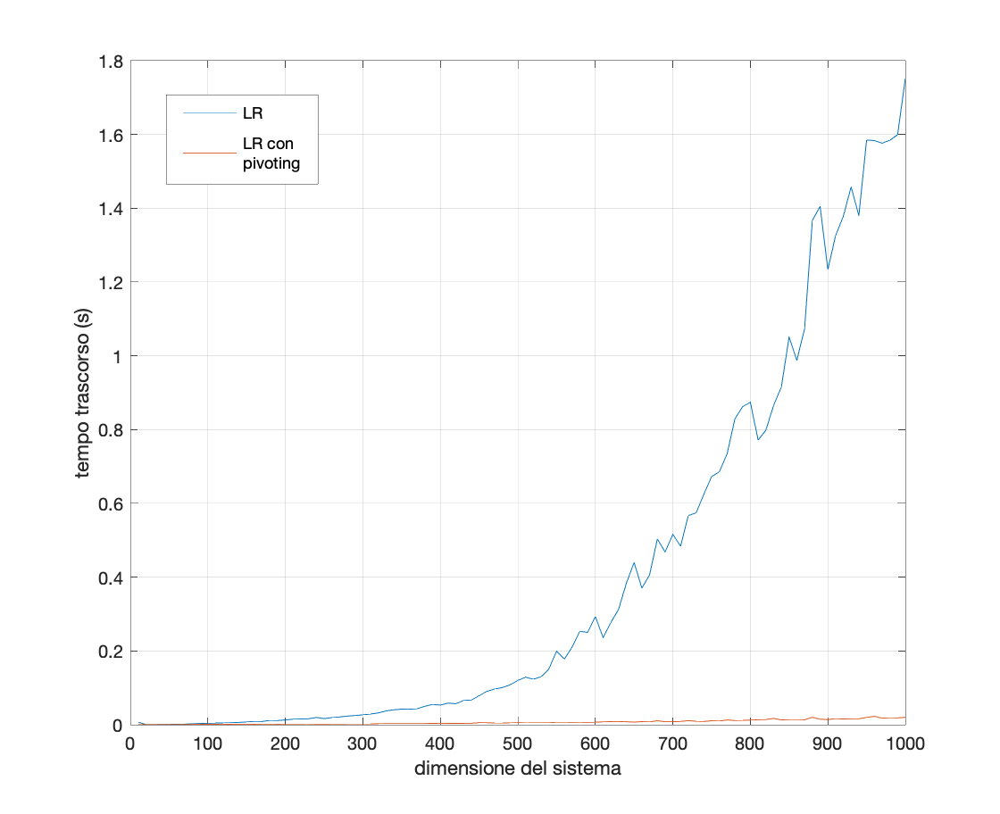
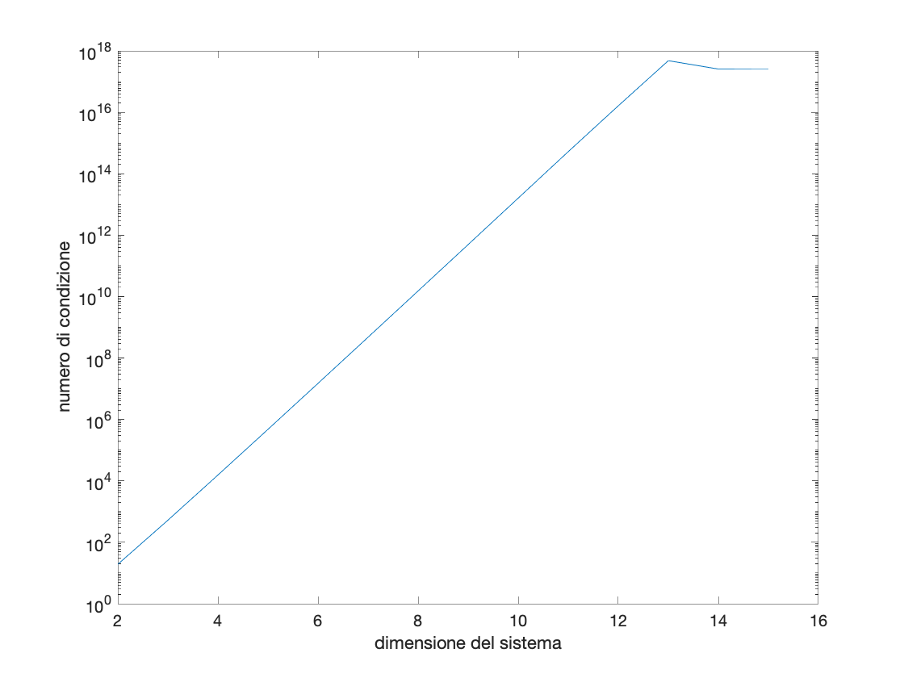
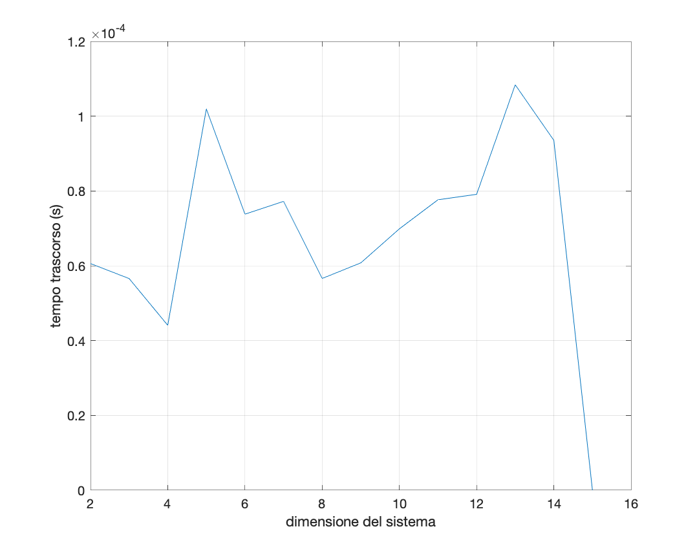

# Relazione 2

La seconda esercitazione riguardava la risoluzione di sistemi lineari utilizzando diversi metodi diretti quali fattorizzazione LR, fattorizzazione LR con pivoting, fattorizzazione di Cholesky.

Il primo metodo esaminato è quello della fattorizzazione LR senza pivoting per una matrice di dimensione arbitraria generata con la funzione MATLAB `randn`. Per questo metodo e per quello con pivoting sono state implementate le funzioni che risolvono un sistema triangolare inferiore, superiore, e quella che applica il **metodo di eliminazione di Gauss**.

Il grafico seguente mostra come il numero di condizione aumenti con sistemi di dimensione maggiori, proprio come ci si aspettava. Da notare che sistemi con dimensione maggiore non per forza avranno un numero di condizione più grande.

Più interessante è osservare come l'errore sul risultato si relazioni con il numero di condizione del sistema. Osservando il seguente grafico si può vedere subito come questi due valori siano strettamente collegati:

Il grafico è stato realizzato tramite la funzione `semilogy` in modo da avere una visualizzazione compatta di tutti i dati, e si può notare che l'andamento del grafico dell'errore è paragonabile a quello del numero di condizione.

Un altro confronto interessante è il tempo impiegato dai diversi algoritmi per calcolare la soluzione del sistema lineare.

Dal grafico si può notare come l'algoritmo di fattorizzazione LR senza impieghi tempo quadratico in funzione della dimensione dell'input per risolvere il sistema, proprio come ci si aspetta dalla teoria. Anche il grafico della fattorizzazione LR con pivoting ha andamento quadratico ma cresce molto più lentamente, contrariamente a quando si potrebbe pensare sapendo che lo scambio di righe provoca un rallentamento di *O(n^3)*; probabilmente questo fenomeno è dovuto ad ottimizzazioni effettuate dalla funzione matlab `lu` con la quale vengono calcolate le due matrici triangolari e quella di permutazione.

La fattorizzazione di Cholesky è il terzo metodo diretto preso in cosiderazione in questa esercitazione, ed è applicabile solamente alle matrici **simmetriche** e **definite positive**. In MATLAB la funzione `hilb` crea una matrice che rispetta queste condizioni, e che quindi può essere fattorizzata proprio usando il metodo di Cholesky. Le matrici di Hilbert sono molto mal condizionate, come illustrato nel grafico seguente:

Come ci si aspettava dalla teoria, il numero di condizione cresce al crescere della dimensione, con una relazione lineare, almeno fino ad un certo punto. Per *n > 13*, si può osservare come questa relazione venga meno. Anche se poco intuitivo, questo fenomeno è probabilmente dovuto al modo in cui la funzione `cond` calcola il numero di condizione in questo caso, cioè tramite SVD. Questo può portare ad errori per valori di *n* grandi, ovvero l'n-esimo valore singolare, che sarà tanto piccolo
da essere approssimato da *ε*. 

Anche la funzione `chol` che applica la fattorizzazione di Cholesky ne risente: come evidenziato dal grafico sottostante che indica il tempo impiegato dall'algoritmo che realizza questa fattorizzazione per *n = 14* (e maggiori), `chol` non considera la matrice appena generata come matrice simmetrica e definita positiva, quindi non permette di calcolare la relativa fattorizzazione. Si può averne una conferma osservando gli autovalori ottenuti dalla funzione `eig`, in cui ne compaiono anche alcuni negativi.

L'ultimo caso preso in considerazione riguarda la fattorizzazione di una matrice **tridiagonale** di dimensioni molto grandi (*n × n*, per n compreso tra 50 e 5000) memorizzata sia in forma completa che in forma sparsa tramite la funzione MATLAB `spdiags`.

La memorizzazione in forma sparsa non si comporta molto diversamente dalla memorizzazione piena, se non per il fatto che la fattorizzazione risulta molto rallentata, ed occorre passare alla forma completa per il calcolo del numero di condizione.
