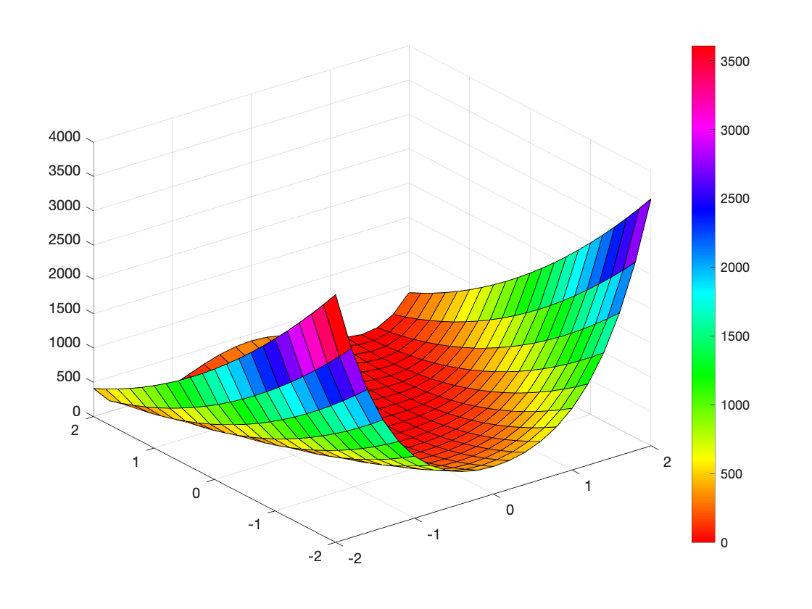
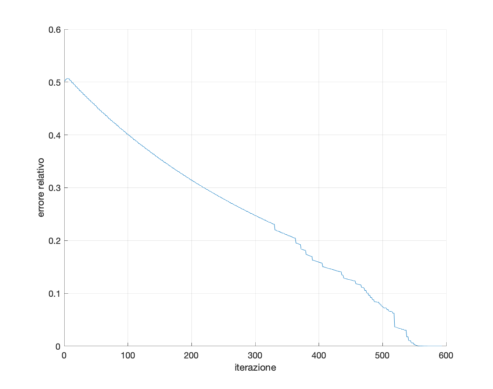
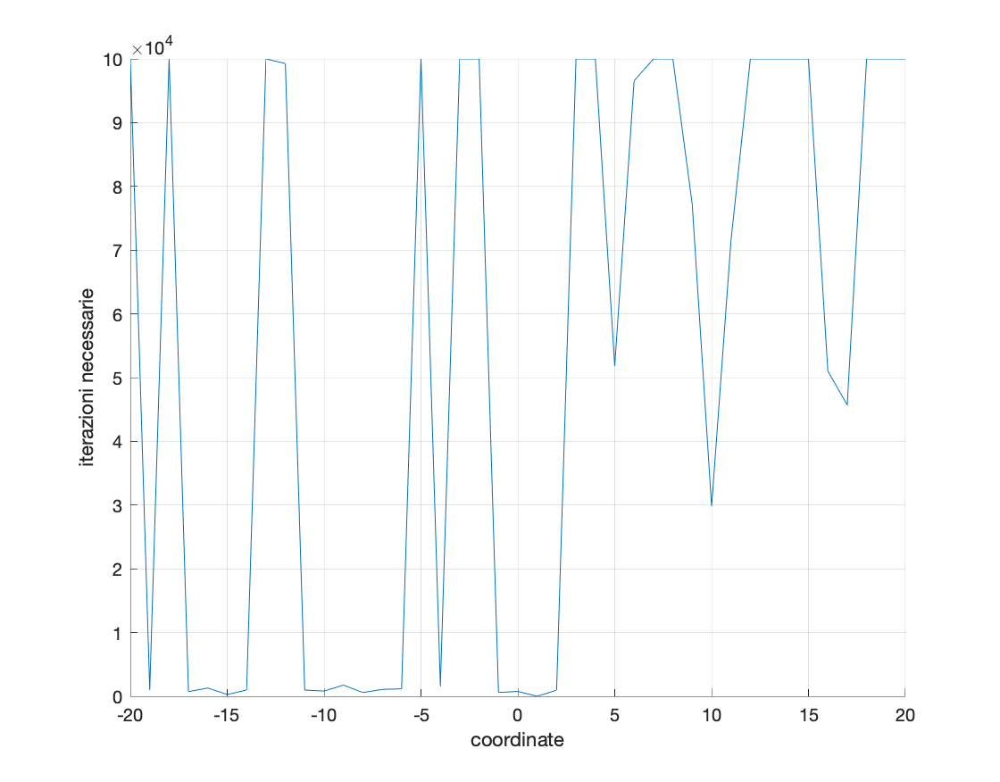
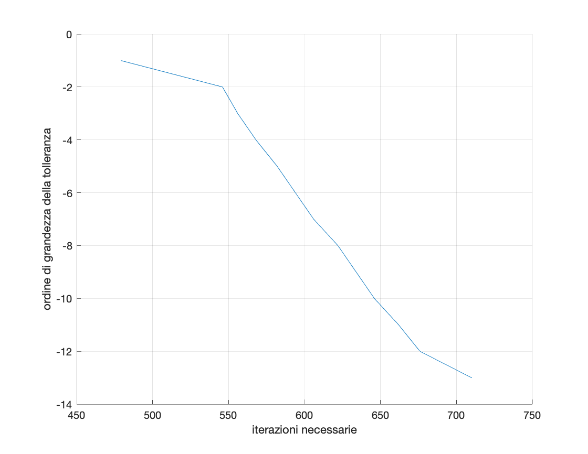

Il secondo esercizio chiedeva di applicare il **metodo del gradiente** per l'ottimizzazione, con scelta del passo tramite algoritmo di backtracking.

Il metodo del gradiente è chiamato così per il modo con cui viene scelta la direzione *p*, che è il **gradiente** della funzione in esame, ed il calcolo di questa è il fattore che incide maggiormente nella complessità dell'algoritmo.
Anche se questo metodo arriva alla soluzione con un numero piuttosto elevato di iterazioni, è comunque **il più utilizzato** dal momento che la complessità della singola iterazione non è elevata, e l'algoritmo risulta quindi sufficientemente efficiente dal punto di vista computazionale.

La funzione considerata è la *funzione di Rosenbrock*, e la seguente immagine ne illustra la superficie:

L'errore relativo che si ottiene per ogni iterazione è descritto dal grafico in Figura 2. Come ci si aspetta dalla teoria, l'errore relativo diminuisce quasi linearmente in relazione al numero di iterazione

I due grafici seguenti invece indicano il numero di iterazioni necessarie per arrivare alla soluzione al variare delle coordinate dell'iterato inizale e della tolleranza.

