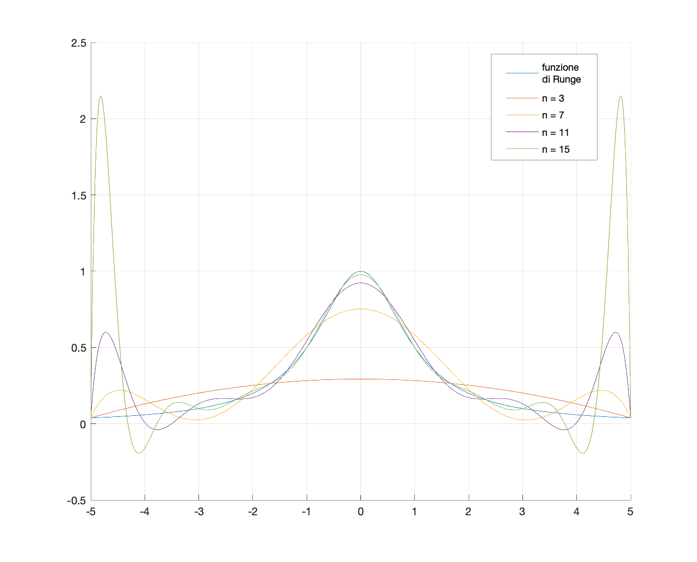
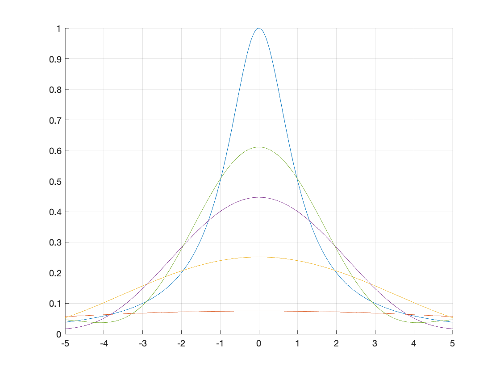

L'ultimo esercizio riguarda il calcolo del **polinomio di interpolazione** nella forma di *Lagrange* in un punto.
La funzione da interpolare è la funzione di Runge, che espone un problema di questo tipo di interpolazione: verso gli estremi dell'intervallo in cui la funzione è considerata, se sono presenti molti punti, il polinomio interpolante presenta degli errori molto grandi rispetto al valore effettivo della funzione.
L'immagine che segue contiene, oltre al grafico della funzione di Runge, anche quelli del polinomio interpolante in diversi punti equispaziati all'interno dell'intervallo [-5, 5]:

Una seconda versione del grafico precedente illustra invece la stessa interpolazione eseguita su punti che corrispondono ai *nodi di Chebishev*.
Questa versione sembra essere più precisa agli estremi dell'intervallo, ma meno precisa al centro.

