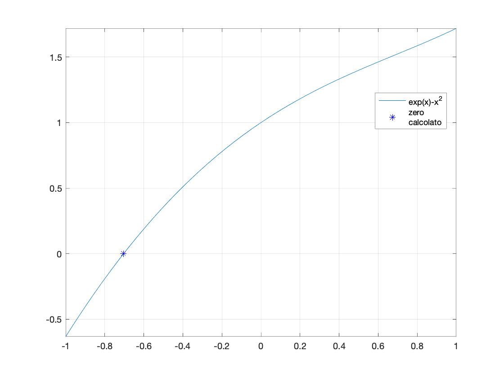
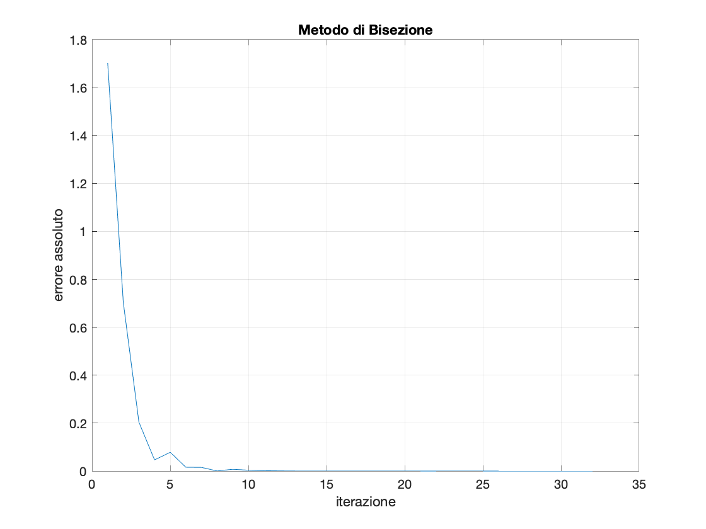
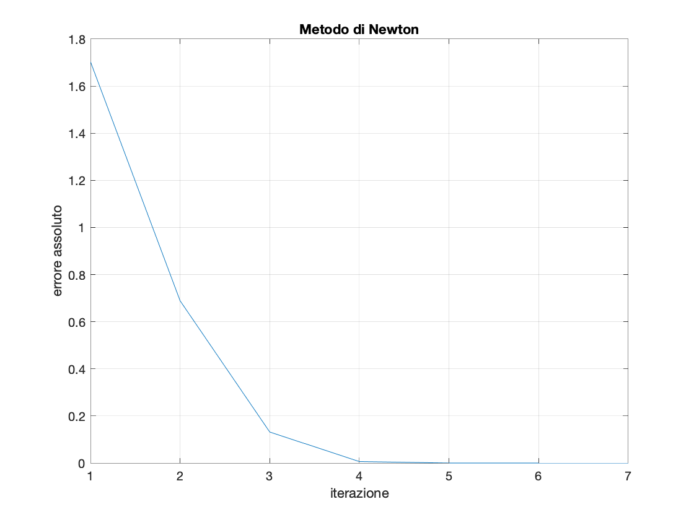

# Relazione 4

Il primo esercizio riguarda il **calcolo dello zero di una funzione**, nel caso non si possa calcolare con i mertodi già visti, o sia computazionalmente difficile.
A questo scopo sono stati realizzati di **bisezione** e di **Newton**.
Entrambi i metodi calcolano con sufficiente precisione il valore corretto dello zero della funzione *e^x - x^2*, cioè *−0.7034674*, come evidenzia il grafico seguente:

I due grafici seguenti mostrano come l'errore decresca più velocemente utilizzando il *metodo di Newton*, che impiega meno iterazioni rispetto al *metodo di bisezione* per raggiungere il livello di precisione desiderato.

